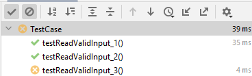

# COMP2046 Programming Assignment 3 - Modern Art

## 2024-25 Semester 1

* Designed by: [Dr. Kevin Wang](mailto:kevinw@comp.hkbu.edu.hk)
* Q & A: [Discord](https://discordapp.com/channels/1004554070083776672/1004554070083776678)
* Assignment Website: [GitHub](https://github.com/khwang0/COMP2046-2425PA2)
* Due: 
  * Programming Due: 23:59pm 4/12/2024 (Wednesday midnight)
* Download the demo program: [here](demo.jar)
* Download everything from the assignment: [here](https://github.com/khwang0/COMP2046-2425PA3/archive/refs/heads/master.zip)

> To run the demo program, type the following in your terminal:
> 
> ```sh
> java -jar demo.jar
> ```
> or if you want to run the program with 4 players
> ```sh
> java -jar demo.jar 4
> ```
>


<sub><sup>

image ref: [BGWalker.com](https://bgwalker.com/product/Modern-Art-(%E8%8B%B1%E6%96%87%E7%89%88)-mDNdg33EFmTsC6iV) 

</sup></sub>

# Learning outcome

Students are expected to have some practices on OO programming, packages,  inheritance, polymorphism, and abstract class. We expect most students would spend eight hours or more to finish the assignment without any assistance. Make sure you start earlier as possible and ask us on Discord if you have any difficulty! 


# Introduction

This is a continuation on PA2, the board game Modern Art! We have updated the three java files [ModernArt.java](ModernArt.java), [players/Player.java](players/Player.java), and [paintings/Painting.java](paintings/Painting.java). Some of these methods are the same as PA2. While some updated methods are labeled with `#update` in the comments. Please read the instructions carefully and complete the methods stated in the skeleton code.

A [sample program](demo.jar) is given to you. When there is something you are not sure, you can take a look at the sample program to decide what to do. 

Some methods are labeled as completed or given. Please don't make any change on those methods. You are not supposed to modify them. **You can add your own method if you want to**. Whenever possible, please refer the constant variables defined in the program.

## Explanation of the game Modern Art

The details rule book of the game is available [here: Rulebook](./modern-art-rulebook.pdf).

Video tutorials of the game are available: 
- (English) https://www.youtube.com/watch?v=CrwHrstvA0k
- (Putonghua) https://www.youtube.com/watch?v=9PGt1krM7Ww


## What is new in PA3?

The new features expected in PA3 are:

### 1. Introducing two more different types of players: `ComputerPlayer` and `AFKPlayer`. 

An AFK player is a player who does not make any bid (always bid 0). When an AFK player is required to play a painting, he will always play the first card. A ComputerPlayer is a player who will make a bidding in a rational way -- it will never bid more than the potential value of a painting, i.e., the maximum possible value that a painting can score in that round. Also, if the painting is owned by the ComputerPlayer, it will bid at most half of the potential value of the painting. (Think about that - if another player bid $X dollar, you can collect $X from the other player but if you spend $X dollar to bid, you will get $Y - $X dollar where $Y is the price of the painting sold.)

### 2. Introducing different types of auctions: Open Auction, Hidden Auction, Fixed Price Auction, One Offer Auction (i.e. no Double Auction).

According to the rulebook, implements these different types of auctions.


## `TestClass` class

> We will also TestClass for you this time to quickly examine if you have violated any obvious rules. However, we will grade your work mainly manually this time.

You don't need to do anything with this java file. The purpose of this file is to conduct some *unit test* for your code. If you are using IntelliJ, you should be able to use this file within a few quick steps. By looking at this file, you should have some ideas of how the TA grade your work!

1. Open the file `TestClass.java`
2. Click on the word `@Test`.
 
 

3. Click the red bulb and select Add **JUnit5** to classpath.
 
 

4. Click the arrow on the left of `public class TestClass` at line 17 and select `Run Tests`.
 
 

5. You shall see the following screen if there isn't any problem
 
   

6. Or you will see some error if your code does not perform what it is suppose to do. For example in the figure below, the test case `testReadValidInput` is not working properly.
 
 

> Note: If you are struggle with this file (e.g. cannot compile your code), simply delete this file. 

# Understanding the Assignment Test (UAT)

- NO UAT this time.


---


# Submission 
For submission, zip your entire intelliJ project and upload the file to Moodle.  

Please be reminded that both the **Late Penalty Rule** and the **Penalty for Plagiarism** are applied strictly to all submissions of this course (including this assignment).   

## Late Penalty Rule

We empathize with students who have difficulties in meeting deadlines. However, we also need to be fair to other students who have submitted their work on time. Therefore, the following late penalty rule will be applied to all submissions of this course (including this assignment).

- Late submission without prior application of due date extension: 10%-50%.
- Late submission with prior approval of due date extension: 0%.


 ## Plagiarism

 Plagiarism is a serious offense and can be easily detected. Please don't share your code to your classmate even if they are threatening you with your friendship. If they don't have the ability to work on something that can compile, they would not be able to change your code to a state that we can't detect the act of plagiarism. For the first commit of plagiarism, regardless you shared your code or copied code from others, you will receive 0 with an addition of 5-mark penalty. If you commit plagiarism twice, your case will be presented in the exam board and you will receive a F directly.


> # Terms about generative AI
> You are not allowed to use any generative AI in this assignment.
> The reason is straight forward. If you use generative AI, you are
> unable to practise your coding skills. We would like you to get
> familiar with the syntax and the logic of the Java programming.
> We will examine your code using detection software as well as 
> inspecting your code with our eyes. Using generative AI tool 
> may fail your assignment.

## Marking Scheme 
There are three elements in the marking scheme: 
* 40% - the program can be compiled without any error
* 60% - Completion of the program according to the requirements, roughly 10% per each auction (x4) and each additional player (computer, AFK), while some adjustment for incorrect implementation of other part of your program.
* up to addition 10% - Additional features that you have added to the program to make it more interesting. (Score more than 100% will be counted towards your PTest2 score directly. e.g, if you got 50/90 in PTest2, and assignment = 105, you will receive 55/90 in PTest2.)
  *  If you attempt the bonus, please write a short description of the bonus feature on Moodle.
  *  What is considered as a bonus depends on what other students have done. If everyone is making rocket science, making a calculator is not considered as a bonus.


> Note: you are not required to follow exactly as the demo program does, e.g. the output text, the order of the output, etc. However, we will use the demo program as a benchmark so that if the demo program fails to handle our edge input, that edge input will not be used in grading too.

Please note that submitting a program that cannot be compiled would result in a very low mark. 

For some features, we will test it using Test Cases. For some other features, we will grade them manually. 

## Interview 
Should the teaching team see fit, students may be requested to attend an interview to explain about their program.  Students failing to attend such interview or to demonstrate a good understanding of their own program may result in mark deduction. 


